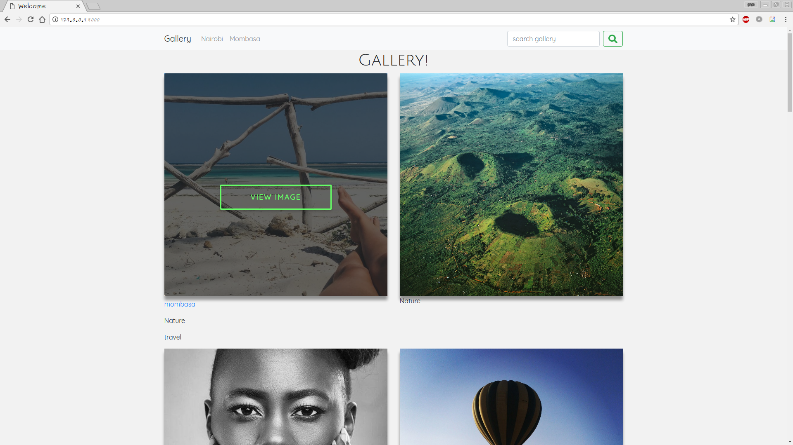

## Gallery

## Author

Sam Ngigi

# DESCRIPTION

This is an app that allows users to view photos and details about them.

#### Gallery Categories
* People
* Nature
* Architecture
* Food

#### User Stories

A user can;

* View different photos that interest me.
* Click on a single photo to expand it and also view the details of the photo.
* Search for different categories of photos. (ie. Travel, Food)
* Copy a link to the photo to share with my friends.
* View photos based on the location they were taken.

## Prerequisites
* Python3.6

## Installation steps
* $ git clone https://github.com/SamNgigi/Gallery/
* $ cd Gallery
* $ source virtual/bin/activate
* Install all the necessary requirements by running pip install -r requirements.txt (Python 3).
* $ ./manager.py runserver

## Credits

#### Moringa School, StackOverflow.com, CodePen.io, Github ,mc7.

# Technologies Used

#### This project uses major technologies which are :
* HTML5
* CSS
* Bootstrap4
* Python3.6
* django
* jQuery

### Known bugs, support and Contacts

- No known bugs

Incase of any please don't hesitate to send a mail to sam.t.ngigi@gmail.com. Thanks

# License

* MIT License

Copyright (c) 2017 Sam Ngigi

Permission is hereby granted, free of charge, to any person obtaining a copy
of this software and associated documentation files (the "Software"), to deal
in the Software without restriction, including without limitation the rights
to use, copy, modify, merge, publish, distribute, sublicense, and/or sell
copies of the Software, and to permit persons to whom the Software is
furnished to do so, subject to the following conditions:

The above copyright notice and this permission notice shall be included in all
copies or substantial portions of the Software.

THE SOFTWARE IS PROVIDED "AS IS", WITHOUT WARRANTY OF ANY KIND, EXPRESS OR
IMPLIED, INCLUDING BUT NOT LIMITED TO THE WARRANTIES OF MERCHANTABILITY,
FITNESS FOR A PARTICULAR PURPOSE AND NONINFRINGEMENT. IN NO EVENT SHALL THE
AUTHORS OR COPYRIGHT HOLDERS BE LIABLE FOR ANY CLAIM, DAMAGES OR OTHER
LIABILITY, WHETHER IN AN ACTION OF CONTRACT, TORT OR OTHERWISE, ARISING FROM,
OUT OF OR IN CONNECTION WITH THE SOFTWARE OR THE USE OR OTHER DEALINGS IN THE
SOFTWARE.*

Copyright (c) 2017 ** [Sam Ngigi]**
